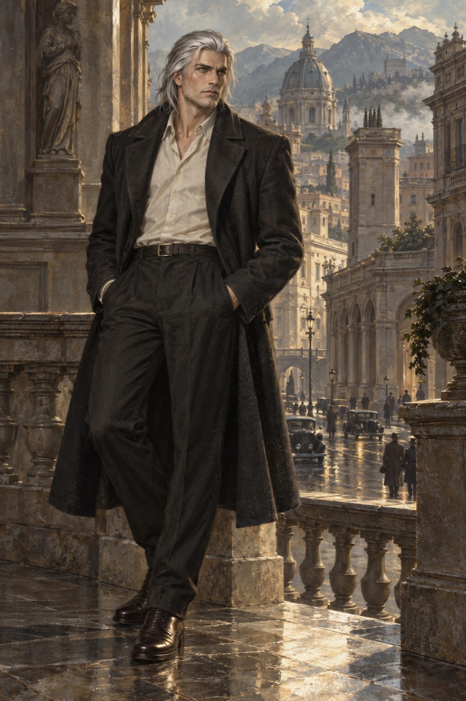
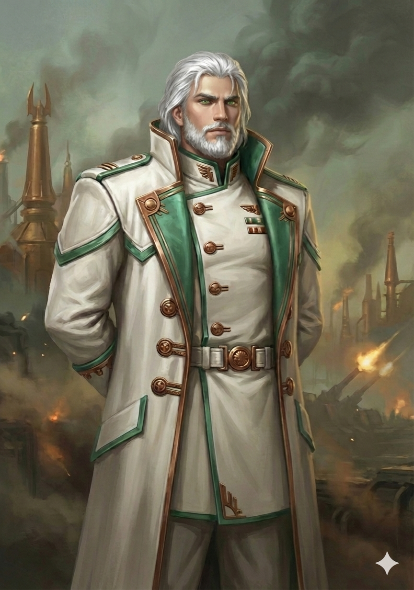

# Galahad - appearance references

## Current expedition appearance

The player-supplied revision 50 artwork establishes his current appearance at departure and throughout the present expedition: swept-back, neck-length white hair; strong, angular features; a long charcoal coat with broad lapels over a pale open-collar shirt; dark high-waisted trousers, a plain dark belt and polished dark leather lace-up boots. Use the image for clothing, bearing and facial appearance in current narration. His established eyes remain vivid green tending toward aquamarine; the image lighting does not change their colour.

At 18/01/0068 AC43 he is approximately two local years and six months old, last measured at 2.59 metres and still growing toward full bodily maturity around age three at 3 metres. A mature-looking face does not advance that timetable. The urban background supplies visual atmosphere rather than a new named location or an enacted journey. The image itself grants no weapon or authority. Clothes were altered during travel; at the current post-confrontation scene he is outside in his shirt, trousers and boots, with his coat still set aside in his guesthouse room.

## Future national or military leadership appearance

The earlier ivory, green and brassy bronze formal portrait is retained as his intended appearance once he takes control of a nation or a nation's military. It is a future reference, not his current outfit and not an automatic change at his third birthday. That political or military achievement has not happened yet. Older adult-projection captions are superseded by this distinction. Preserve both original images for future continuity.

Editable-source originals: assets/portrait-expedition-r50.jpg and assets/portrait.png. Public copies use the filenames above.
