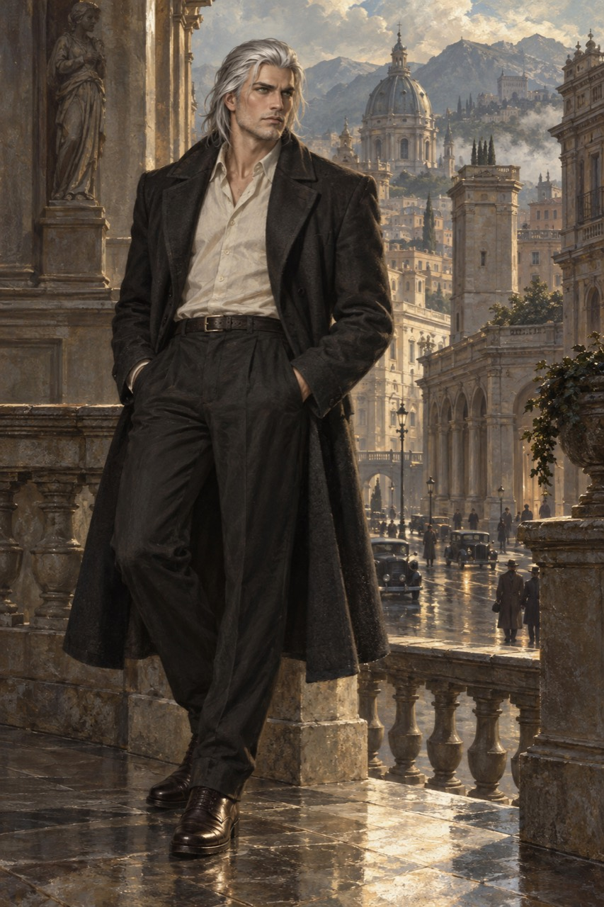
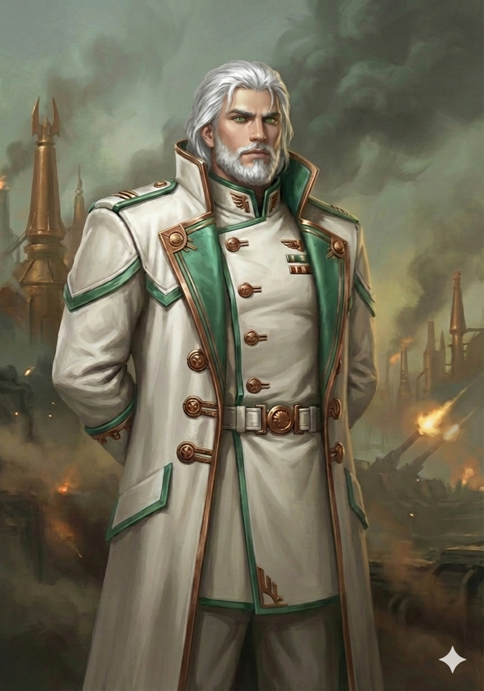

# Galahad - appearance references

## Opening appearance and actual age

At story Day 0 / planetfall, Galahad was approximately one local month old, but appeared like a five- to six-year-old human child because of accelerated development. This is an appearance comparison, not five or six years of lived experience. Chronological age advances by elapsed local time from that approximately one-month starting age; full bodily maturity is recorded separately.

## Current expedition appearance

The player-supplied revision 50 artwork establishes his departure appearance and the clothing style retained through the completed expedition: swept-back, neck-length white hair; strong, angular features; a long charcoal coat with broad lapels over a pale open-collar shirt; dark high-waisted trousers, a plain dark belt and polished dark leather lace-up boots. Use the image for clothing, bearing and facial appearance in current narration. His established eyes remain vivid green tending toward aquamarine; the image lighting does not change their colour.

At 19/01/0069 AC43 he is approximately three local years and five months, plus roughly three weeks, bodily mature at about 3 metres, with a short white beard grown during the expedition. The earlier 2.59-metre measurement is historical; the artwork predates his final growth and beard. The urban background supplies visual atmosphere rather than a new named location or an enacted journey. The image itself grants no weapon or authority. Clothes were repeatedly tailored in the same style during travel. His established Auvrienne clothing remains his charcoal coat, shirt, dark trousers and boots, in the established style. His technical commission is not control of the nation or its military, so it does not unlock the future leadership outfit.

## Future national or military leadership appearance

The earlier ivory, green and brassy bronze formal portrait is retained as his intended appearance once he takes control of a nation or a nation's military. It is a future reference, not his current outfit and not an automatic change at his third birthday. That political or military achievement has not happened yet. Older adult-projection captions are superseded by this distinction. Preserve both original images for future continuity.

Editable-source originals: assets/portrait-expedition-r50.jpg and assets/portrait.png. Public copies use the filenames above.

The 12/11 Royal Advisor appointment does not establish national or army leadership for the future formal portrait. The charcoal expedition style remains current.
