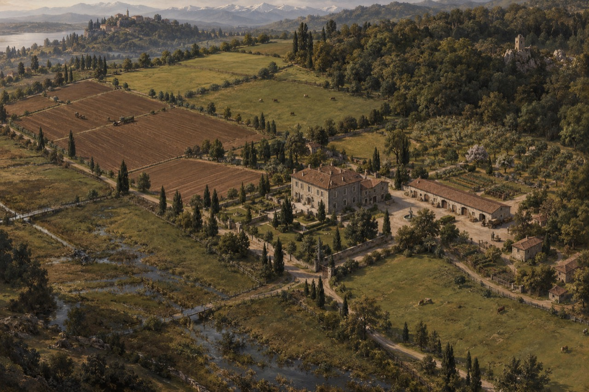

# House Orsival — current visual reference

Revision 48 · Player-supplied estate artwork · Visual baseline recorded before departure, 21/10/0067 AC43. Current review: 18/01/0068 AC43; no newer artwork or major completed alteration recorded.

The image is the accepted visual reference for the estate as it looks now. Its weathered grey-stone main house, terracotta roofs, adjoining service wing, long arcaded outbuilding across the courtyard, enclosed domestic gardens and tree-lined approaches establish the scene’s appearance. A small courtyard water feature stands among the working yards and garden walls. Smaller service buildings sit along the approach lanes.

Cultivated fields extend behind and to the left of the house. Pasture lies across the gentler foreground and middle slopes; orchard rows occupy ground to the right, with woodland rising beyond. Wet lower ground, drainage channels and small crossings occupy the left foreground. Distant water, a hill settlement, mountain ridges and a tower or ruin on the wooded right-hand ridge form the broader landscape.

## Applying the reference in the story

Use this image when describing arrival, views from the house, movement around the domestic grounds and the relation between cultivated land, wet ground and woodland. Preserve the established interior: the ground-floor guest bedroom, sitting/dining rooms, drive-facing study, upstairs bedrooms and designated library/archives. The long low storehouse across the service yard remains the intended workshop; its dry, secure repair programme and future equipment remain governed by the existing scene and accounts.

The accepted estate remains 56 hectares: 20 arable, 12 meadow/pasture, 14 woodland, 6 orchard/market ground and 4 buildings, cottages, tracks and domestic ground. This perspective view is not a cadastral survey. Distant villages, mountains, water and the wooded tower are surrounding scenery unless ownership is established later. Visible figures, carts and animals do not create a new inventory of personally owned assets or staff. Existing tenancies, limited repairs, financial allocations and projected income remain as recorded.

The artwork depicts the present property; it does not imply that all planned maintenance, furniture or workshop improvements are already complete. Corva and Veskan live here, with Lucette managing daily household service. No story time passes through adopting the image.

## Future changes

Retain this revision’s original image as the dated baseline. When development, damage, construction or land acquisition actually changes the estate, record the change in continuity and update the visual reference accordingly. Until a revised image is supplied or created, describe enacted changes explicitly rather than silently treating the older artwork as the new state. Do not infer a completed improvement from a plan or a budget allocation.
