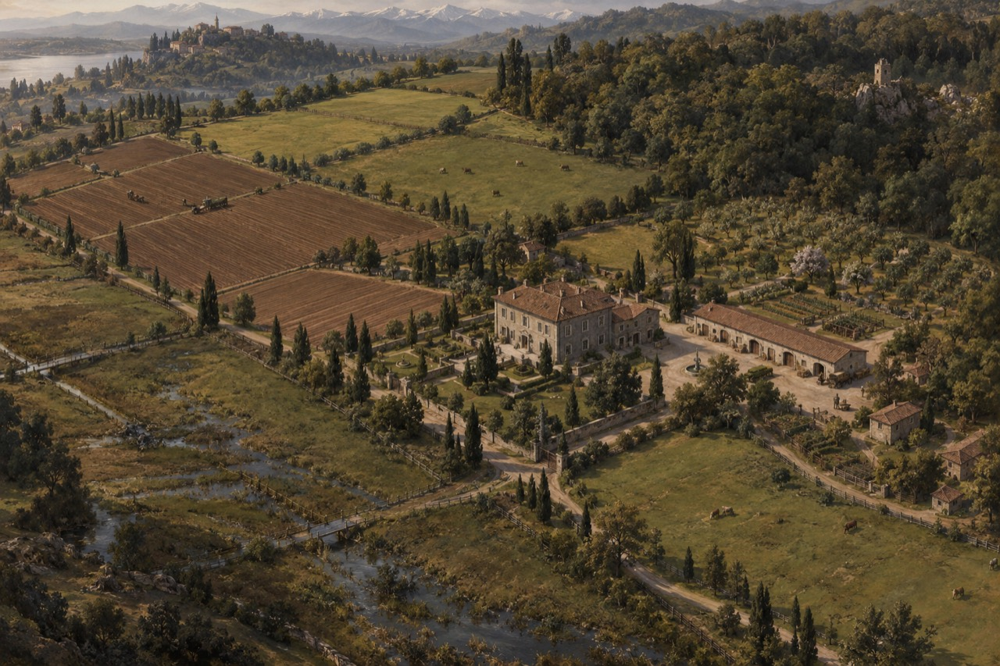

# House Orsival — current visual reference

Revision 48 · Player-supplied estate artwork · Visual baseline recorded before departure, 21/10/0067 AC43. Current review: 25/02/0069 AC43. No newer artwork; initial repairs and first furniture purchases are now complete.

The image is the accepted visual reference for the estate as it looks now. Its weathered grey-stone main house, terracotta roofs, adjoining service wing, long arcaded outbuilding across the courtyard, enclosed domestic gardens and tree-lined approaches establish the scene’s appearance. A small courtyard water feature stands among the working yards and garden walls. Smaller service buildings sit along the approach lanes.

Cultivated fields extend behind and to the left of the house. Pasture lies across the gentler foreground and middle slopes; orchard rows occupy ground to the right, with woodland rising beyond. Wet lower ground, drainage channels and small crossings occupy the left foreground. Distant water, a hill settlement, mountain ridges and a tower or ruin on the wooded right-hand ridge form the broader landscape.

## Applying the reference in the story

Use this image when describing arrival, views from the house, movement around the domestic grounds and the relation between cultivated land, wet ground and woodland. Preserve the established interior: the ground-floor guest bedroom, sitting/dining rooms, drive-facing study, upstairs bedrooms and designated library/archives. The long low storehouse across the service yard remains the intended workshop; its building is now dry, secure and lit after repairs, while benches, machinery and specialist equipment remain unpurchased.

The accepted estate remains 56 hectares: 20 arable, 12 meadow/pasture, 14 woodland, 6 orchard/market ground and 4 buildings, cottages, tracks and domestic ground. This perspective view is not a cadastral survey. Distant villages, mountains, water and the wooded tower are surrounding scenery unless ownership is established later. Visible figures, carts and animals do not create a new inventory of personally owned assets or staff. Existing tenancies and boundaries remain. Actual receipts, paid repairs and household funds are reconciled in ESTATE-ACCOUNTS.md; the annual forecast remains a separate model.

The artwork records the predeparture property. Narration must add the completed initial repairs and first furniture purchases; it does not imply an equipped workshop or completion of all later furnishing. Corva and Veskan live here, with Lucette managing daily household service. Since the artwork, a telephone has been installed in the study, two trained watchhounds acquired and minor tenant drainage/roof defects repaired. Galahad’s former Collegium possessions and private collections arrived on 22/10. Five household rifles and 100 ordinary rounds have since arrived at the estate. These later possessions are not depicted in the baseline image. No story time passes through adopting the image.

## Future changes

Retain this revision’s original image as the dated baseline. When development, damage, construction or land acquisition actually changes the estate, record the change in continuity and update the visual reference accordingly. Until a revised image is supplied or created, describe enacted changes explicitly rather than silently treating the older artwork as the new state. Do not infer a completed improvement from a plan or a budget allocation.

## Household investment authority and required review — 25/02/0069 AC43

Corva and Veskan are authorised to make informed investments without obtaining Galahad's approval for each purchase. Their remit includes opportunities outside the estate. Corva maintains the accounts; both parents participate in decisions. Dorlac is an available business contact, not an automatically signed partnership. The previously discussed brewery remains tabled unless an actual later decision revives it.

Read [Delegated NPC decisions during elapsed time](NARRATOR-GUIDE.md#delegated-npc-decisions-during-elapsed-time) before advancing estate activity. Budget, local opportunities, their judgement, risk, workload and elapsed time determine decisions. Rolls resolve genuine uncertainty, not whether they remember instructions. Each substantial time skip must produce a concrete review and a decision, a specific negotiation with a next milestone, or a substantiated reason to decline. Do not leave them indefinitely investigating simply because Galahad is elsewhere.

The additional 500-lorrat contribution during 20–24/01 is enacted. Latest narrated household cash at 25/02 is **1,678: 148 reserved and 1,530 uncommitted**. Reconciliation: 1,194 at 19/01 + 500 contribution + 50 subsequent operating receipts - 66 operating payments = 1,678. No new investment purchase has been enacted. The repeated lack of an investment decision was a narrator omission, not a character trait. The elapsed review is outstanding and must be resolved before another substantial time skip. This documentation correction itself spends nothing and selects no investment. ESTATE-ACCOUNTS.md and commission-accounts.json now reconcile the 25/02 return; the 19/01 statement is historical.

## Enacted additions after the baseline image

On 19/01 Galahad mounted his retained Vouressan-bone sword horizontally on the study wall. It remains valuable, but no appraisal, sale or replacement commission occurred. His several dozen new ciphered research pages were filed here on 20/01. Previous clothes were cleaned and stored while he took fresh clothing back to the VAA site. No new estate building, crop conversion, armed guard appointment or machinery purchase.
